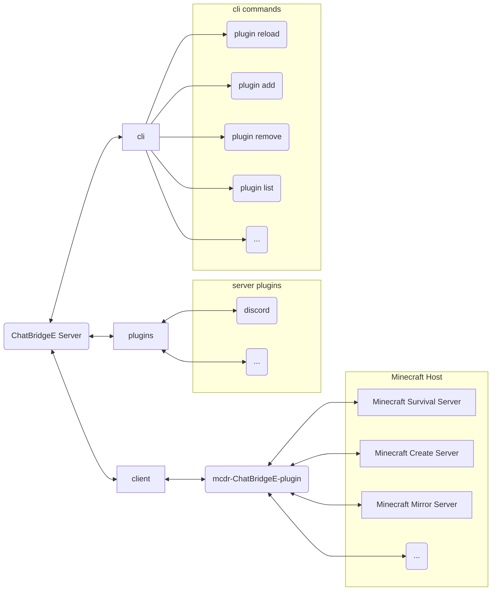

# chat-bridgee

開發想法來自 [`TISUnion/ChatBridge`](https://github.com/TISUnion/ChatBridge) minecraft mcdr chat bridge 實現

## 警告

由於採用明文傳輸，請於防火牆中關閉 `8081` 或是您所設定的端口，在傳輸中可能會包含 `RCON 密碼/端口` 等私密信息，請做好安全防範。

## 事件說明

以下 `用戶端` 皆指 `MCDR 端`，事件名後的代號有以下說明

| 代號  | 代表                                       |
| :---: | ------------------------------------------ |
|  `S`  | 由伺服器發送                               |
|  `C`  | 由用戶端發送                               |
|  `A`  | 由伺服器向全部用戶端發送並排除事件原觸發者 |

### 轉發事件 [C-A]

由用戶端發送至伺服器，伺服器進行轉發並呼叫插件中註冊的事件

#### `server_start` -> `server_start` [C-A]

客戶端伺服器啟動中的事件
> args: [ctx: Context]

#### `server_startup` -> `server_startup` [C-A]

客戶端伺服器啟動完成的事件
> args: [ctx: Context]

#### `server_stop` -> `server_stop` [C-A]

客戶端伺服器關閉的事件
> args: [ctx: Context]

#### `player_chat` -> `player_chat` [C-A]

於客戶端伺服器玩家發送的訊息事件
> args: [ctx: Context, player_name: str, content: str]

#### `player_joined` -> `player_joined` [C-A]

於客戶端伺服器玩家加入的訊息事件
> args: [ctx: Context, player_name: str]

#### `player_left` -> `player_left` [C-A]

於客戶端伺服器玩家退出的訊息事件
> args: [ctx: Context, player_name: str]

#### `file_sync` -> `file_sync` [C-A]

檔案同步事件，需搭配 `FileEncode` 類別，將會把資料編譯成 `bytes` 以下為生成的數據範例:

| `offset` | `bytes` | `description`          |
| -------- | ------- | ---------------------- |
| `0`      | `1`     | flag                   |
| `1`      | `2`     | path length (n)        |
| `3`      | `n`     | path                   |
| `3+n`    | `2`     | data length (m)        |
| `5+n`    | `m`     | data                   |
| `5+n+m`  | `2`     | server name length (o) |
| `7+n+m`  | `o`     | server name            |

進行編碼時 -> `FileEncode(...args).encode()`
進行解碼時 -> `FileEncode.decode(<bytes>)`

`FileEncode` 類別分別於:

- `Client` -> `chatbridgee/utils.py` (`from chatbridgee.utils import FileEncode`)
- `Server` -> `server/utils/utils.py` (`from server.utils import FileEncode`)

> args: [ctx: Context, data: FileEncode]

### 一對一事件 [S-C]|[C-S]

#### `extra_command` -> `cmd_callback` 額外指令 [S-C]

由伺服器發送至客戶端，客戶端會返回 `cmd_callback` 事件
目前包含以下事件

- `stats` command
  - success
    > code: 0
    >
    > stats_name: <請求的統計名>
    >
    > data: <請求的統計資料>
    >
    > total: <統計總計值>
  - unknown stats
    > code: 1
  - no stats_helper
    > code: 2

#### `ping` -> `server_pong` [C-S]

當有人向伺服器發起 `ping` 伺服器會向對方發送

#### `error` [S]

向用戶端發送錯誤訊息，ex: `登入失敗`,`重複登入`

### 其它

#### `new_connect` [A]

當新的用戶與伺服器連接時呼叫

#### `new_disconnect` [A]

當有用戶與伺服器斷開連接時呼叫

## 參考

1. [`discord.py cog load method`](https://github.com/Rapptz/discord.py)
2. [`carpet-scripts:format function`](https://github.com/gnembon/fabric-carpet/blob/master/docs/scarpet/Full.md#formatcomponents--formatcomponents-)
