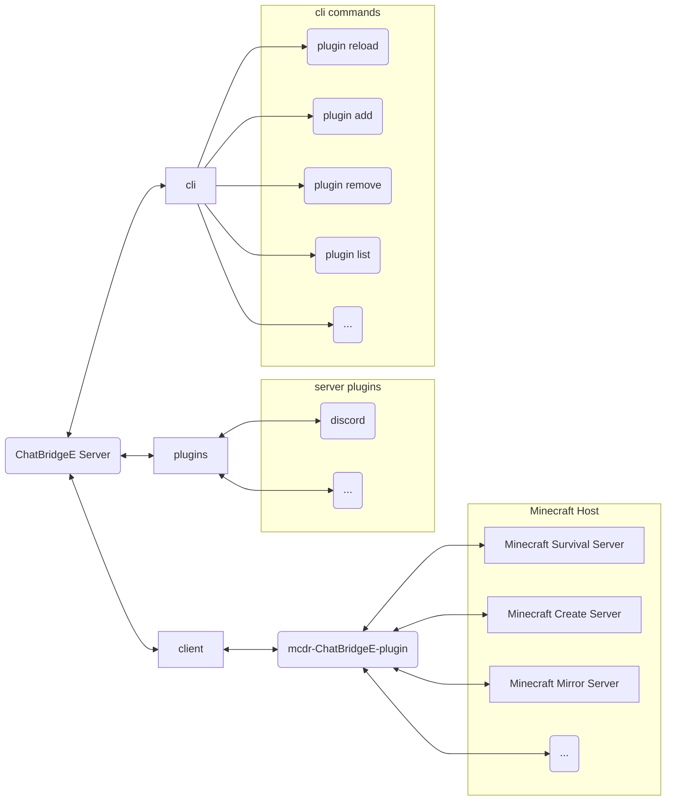

# chat-bridgee

開發想法來自 [`TISUnion/ChatBridge`](https://github.com/TISUnion/ChatBridge) minecraft mcdr chat bridge 實現

## 參考

1. [`discord.py cog load method`](https://github.com/Rapptz/discord.py)
2. [`carpet-scripts:format function`](https://github.com/gnembon/fabric-carpet/blob/master/docs/scarpet/Full.md#formatcomponents--formatcomponents-)
